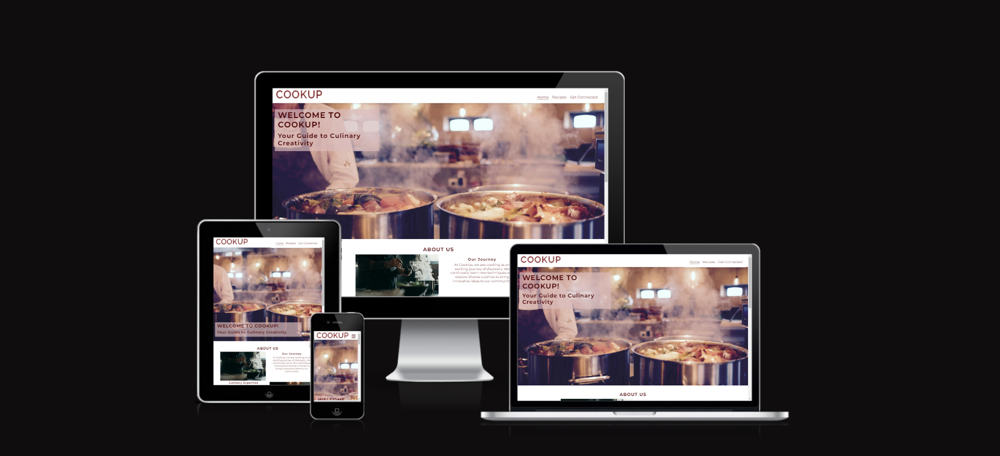
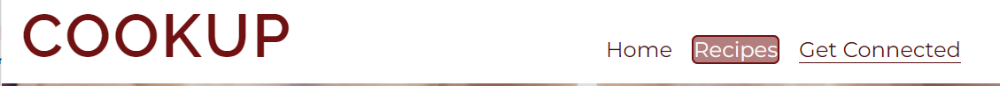
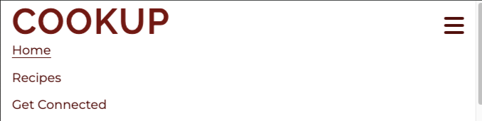

# COOKUP

COOKUP is a static website designed to help you improve your cooking skills. Whether you're a beginner or an experienced cook, COOKUP offers a wealth of resources including step-by-step guides, video tutorials, and expert tips to make cooking both easy and enjoyable. Our curated content is aimed at helping you master techniques, discover new recipes, and enhance your culinary repertoire.

At COOKUP, we believe that cooking is a journey best shared. Join our vibrant community to discover diverse recipes, exchange ideas, and gain confidence in the kitchen. With COOKUP, you can turn everyday meals into extraordinary experiences, creating delicious dishes and lasting memories. Explore, learn, and cook with us, and elevate your culinary adventures today!

The link to the website is here - [Cook Up](https://aimanh04.github.io/portfolio-1-project/getconnected.html)

## FEATURES

### Navigation

- The navbar is featured on all three pages. The navbar is fully responsive and contains of the logo, Home page, Recipes page and Get Connected page and is identical in all three pages for easy navigation to the user.
- The navigation is clear and tells the user the name of the website and makes the pages of the website easy to find.
- On large screen sizes when hovering over the menu items on the navbar the item will appear in a darker color and the text will change to white.
- The page the user is on will show on the navbar by having a underline under the specific page they are in.

- The navigation bar turns into a burger menu with a dropdown of all pages on smaller screens
- When you click on the logo on the navbar you will be redirected to the index page.

## TESTING

## TECHNOLOGIES USED
### Languages

- HTML 
- CSS

### Frameworks, Libraries and Programes used

- [Balsamiq](https://balsamiq.com/wireframes/) - Used to create wireframes
- [GitHub](https://GitHub.com/) - To save and store files for the website
- [Gitpod](https://gitpod.io/) - To use as workspace to code website
- [Google Fonts](https://fonts.google.com/) - To import fonts into website
- [Chrome Dev Tools](https://developers.google.com/web/tools/chrome-devtools) - Used to troubleshoot, test the sites responsiveness, check the page's elements and style elements
- [Pexels](https://www.pexels.com/) - Used to import free images
- [Unsplash](https://unsplash.com/de) - Used to import free images
- [Favicon](https://www.favicon.cc/) - Used for the wbesites favicon
- [Chrome Lighthouse](https://developers.google.com/web/tools/lighthouse) - To test the websites performance and accesibility
- [Am I Responsive](https://ui.dev/amiresponsive) - Used to test responsivness
- [Convertio](https://convertio.co/) - Used to convert images into webp formats
- [ChatGPT](https://chatgpt.com/) - Used to create texts and paragraphs

## VALIDATOR TESTING

## UNFIXED BUGS

## DEPLOYMENT

The website has been deployed to GitHub. Here were the steps as followed to deploy:
1. Log in to GitHub.
2. In your GitHub repository, navigate to the settings tab.
3. Select "Pages" on the Codes and automation section on the left-hand sidebar.
4. Select the following:
- The source is set to "Deploy from branch"
- Main branch shall be selected
- Folder is set to / (root).
5. Click save next to /root.
6. Go back to the code tab. Refresh your repository and a deployment section will show up with your deployed project.

The live link to the website is here - [CookUp](https://aimanh04.github.io/portfolio-1-project/)

## CREDITS
