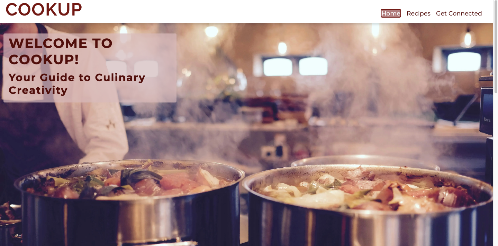
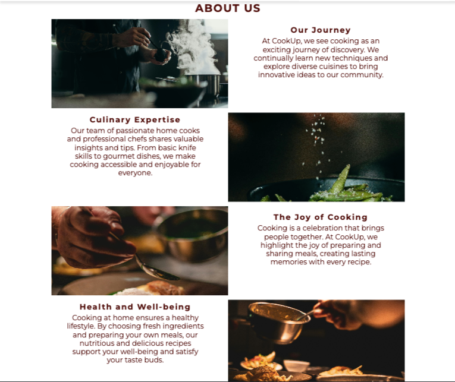
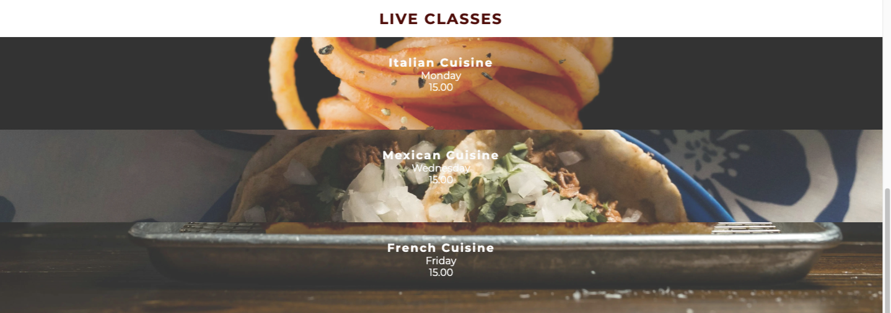
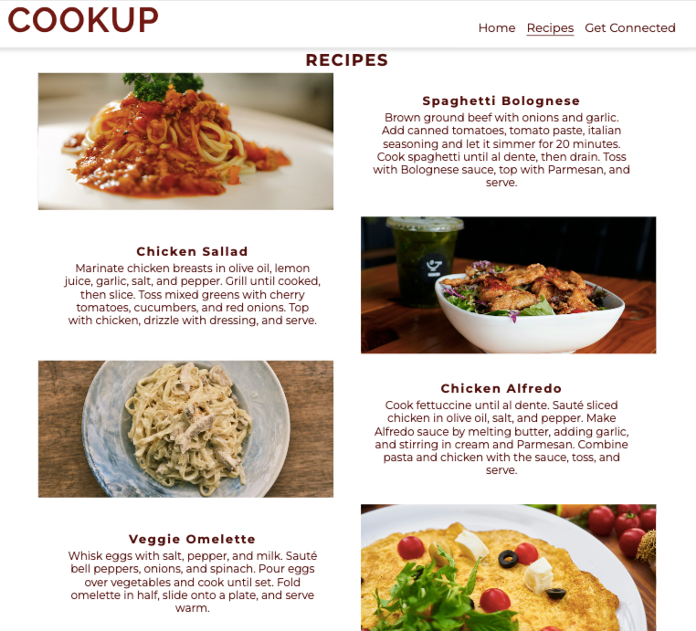
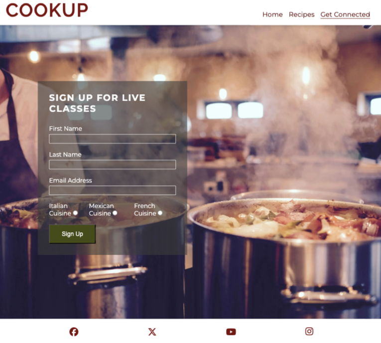
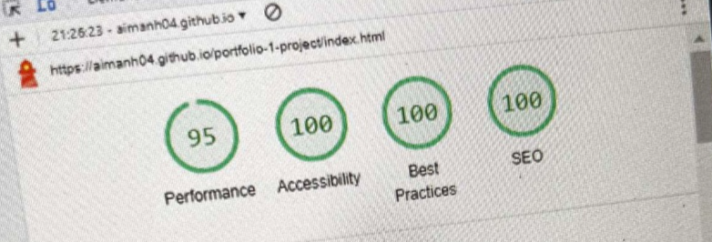
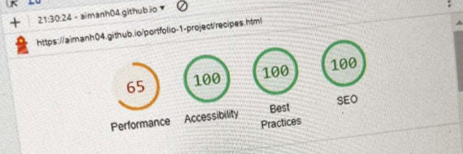
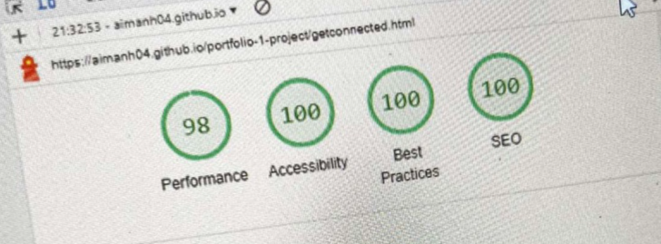

# COOKUP

COOKUP is a static website designed to help you improve your cooking skills. Whether you're a beginner or an experienced cook, COOKUP offers a wealth of resources including step-by-step guides, video tutorials, and expert tips to make cooking both easy and enjoyable. Our curated content is aimed at helping you master techniques, discover new recipes, and enhance your culinary repertoire.

At COOKUP, we believe that cooking is a journey best shared. Join our vibrant community to discover diverse recipes, exchange ideas, and gain confidence in the kitchen. With COOKUP, you can turn everyday meals into extraordinary experiences, creating delicious dishes and lasting memories. Explore, learn, and cook with us, and elevate your culinary adventures today!

The link to the website is here - [Cook Up](https://aimanh04.github.io/portfolio-1-project/getconnected.html)

## FEATURES

### Navigation

- The navbar is featured on all three pages. The navbar is fully responsive and contains of the logo, Home page, Recipes page and Get Connected page and is identical in all three pages for easy navigation to the user.
- The navigation is clear and tells the user the name of the website and makes the pages of the website easy to find.
- On large screen sizes when hovering over the menu items on the navbar the item will appear in a darker color and the text will change to white.
- The page the user is on will show on the navbar by having a underline under the specific page they are in.

- The navigation bar turns into a burger menu with a dropdown of all pages on smaller screens
- When you click on the logo on the navbar you will be redirected to the index page.

### Footer
 - This footer section includes the websites social media pages.
 - When clicking on a icon on the footer, you will be redirected to another tab to that social media platform

 

### Index Page

#### Home Page Image

- The image prominently features a man cooking in a kitchen and gives the website a visually pleasing look.
- The cover text on the image is semi-transparent and has text welcoming the user to the website.
- This image is fully responsive and the cover text moves to the bottom of the image on smaller screen so the message still delievers to the user.

#### About Us Section

- The about us section is divided into four parts. Each part containing a brief text informing the user about the website with a cooking-related image next to it.
- This section shows brief intel about the website, its goals with cooking and why you should learn to cook.
- This section is responsive by ordering the images and texts under one another on smaller devices.

#### Live Classes Section

- The Live Classes section displays three images with text of each class and time.
- This section allows the user to see what classes are available and what time they take place.

### Recipes Page

- This page of the website is very much similar to the about us section on the index page. It is subdivided into four parts with a collection of various recipes, each with a image, title and a brief description.
- Each recipe includes details instructions and ingredients.
- Very much like the about us section on the index page, this page and its content shows ordered under one another on smaller devices making it fully responsive.

### Get Connected Page

- This page is where the user signs up to the live classes and the page displays a signup form with the necessary user information needed: First name, last name, email-address and what class the user wants to attend.
- This page is fully responsive and will adapt accordingly to any screen size.

## TESTING
### Accesibility

#### Lighthouse testing
#### Index Page

#### Recipes page

#### Get Connected page

### Validator Testing

#### HTML
No errors were found on the three pages when testing it with the W3C Markup Validator.

- [Index page HTML Validator results](https://validator.w3.org/nu/?showsource=yes&doc=https%3A%2F%2Faimanh04.github.io%2Fportfolio-1-project%2F)

- [Recipes page HTML Validator results](https://validator.w3.org/nu/?showsource=yes&doc=https%3A%2F%2Faimanh04.github.io%2Fportfolio-1-project%2Frecipes.html)

- [Get Connected HTML Validator results](https://validator.w3.org/nu/?showsource=yes&doc=https%3A%2F%2Faimanh04.github.io%2Fportfolio-1-project%2Fgetconnected.html)

#### CSS
No errors were found for the CSS Stylesheet from the W3C CSS Validator.

- [CSS Stylesheet Validator results](https://jigsaw.w3.org/css-validator/validator?uri=https%3A%2F%2Faimanh04.github.io%2Fportfolio-1-project%2F&profile=css3svg&usermedium=all&warning=1&vextwarning=&lang=sv)

### Links testing

- All the links works perfectly and has been successfully tested to redirect you to the page desired.
- All external links works and redirects you to the page with a seperate tab.

### Browser testing
The website has been successfully tested on these browers:

- Google Chrome
- Mozilla Firefox
- Safari

### Unfixed bugs

- No known bugs has been left unfixed

## TECHNOLOGIES USED
### Languages

- HTML 
- CSS

### Frameworks, Libraries and Programes used

- [Balsamiq](https://balsamiq.com/wireframes/) - Used to create wireframes
- [GitHub](https://GitHub.com/) - To save and store files for the website
- [Gitpod](https://gitpod.io/) - To use as workspace to code website
- [Google Fonts](https://fonts.google.com/) - To import fonts into website
- [Chrome Dev Tools](https://developers.google.com/web/tools/chrome-devtools) - Used to troubleshoot, test the sites responsiveness, check the page's elements and style elements
- [Pexels](https://www.pexels.com/) - Used to import free images
- [Unsplash](https://unsplash.com/de) - Used to import free images
- [Favicon](https://www.favicon.cc/) - Used for the wbesites favicon
- [Chrome Lighthouse](https://developers.google.com/web/tools/lighthouse) - To test the websites performance and accesibility
- [Am I Responsive](https://ui.dev/amiresponsive) - Used to test responsivness
- [Convertio](https://convertio.co/) - Used to convert images into webp formats

## DEPLOYMENT

The website has been deployed to GitHub. Here were the steps as followed to deploy:
1. Log in to GitHub.
2. In your GitHub repository, navigate to the settings tab.
3. Select "Pages" on the Codes and automation section on the left-hand sidebar.
4. Select the following:
- The source is set to "Deploy from branch"
- Main branch shall be selected
- Folder is set to / (root).
5. Click save next to /root.
6. Go back to the code tab. Refresh your repository and a deployment section will show up with your deployed project.

The live link to the website is here - [CookUp](https://aimanh04.github.io/portfolio-1-project/)

## CREDITS

### Special Thanks To

- Code Institutes learning material from the diploma-educations and the essentials on HTML and CSS. Especially the Love Running walkthrough project.

- [ChatGPT](https://chatgpt.com/) - Used to create texts and paragraphs on my website when I lacked creativity.

- [W3CSchools](https://www.w3schools.com/)

- [Stack Overflow](https://stackoverflow.com/)

- [Slack](https://slack.com/)

### Media

The photos used on the website was taken from Pexels & Unsplash. Special thanks to these talented photographers:
 - [Hero Image & Get Connected Page Image](https://www.pexels.com/sv-se/foto/66639/) - Timur Saglambilek
 - [About Us Image](https://www.pexels.com/sv-se/foto/mat-restaurang-man-person-3298637/) - Cottonbro studio
 - [About Us Image](https://www.pexels.com/sv-se/foto/mat-halsosam-person-kvinna-3338497/) - Cottonbro studio
 - [About Us Image](https://www.pexels.com/sv-se/foto/mat-tallrik-restaurang-man-2403391/) - Yente Van Eynde
 - [About Us Image](https://www.pexels.com/sv-se/foto/mat-halsosam-restaurang-hand-2403392/) - Yente Van Eynde
 - [Live Classes Image](https://unsplash.com/photos/fork-with-spaghetti-Pvclb-iHHYY) - Mae Mu
 - [Live Classes Image](https://unsplash.com/photos/cooked-food-on-white-ceramic-plate-BpmEx2YgqWM) - Diego Lozano
 - [Live Classes Image](https://www.pexels.com/sv-se/foto/man-hander-maltid-ost-27100872/) - Alex Gonzo
 - [Recipes Images](https://www.pexels.com/sv-se/foto/mat-tallrik-italienska-restaurang-6287525/) - Klaus Nielsen
 - [Recipes Images](https://unsplash.com/photos/a-bowl-of-food-next-to-a-drink-e7R3W8_8zws) - You Le
 - [Recipes Images](https://www.pexels.com/sv-se/foto/italienska-pasta-bord-kyckling-11220209/) - Engin Akyurt
 - [Recipes Images](https://www.pexels.com/sv-se/foto/1437268/) - Engin Akyurt